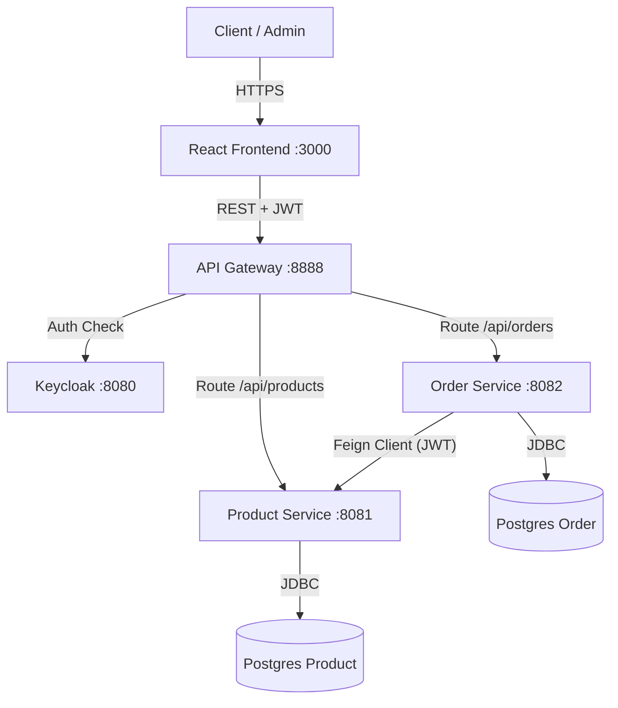
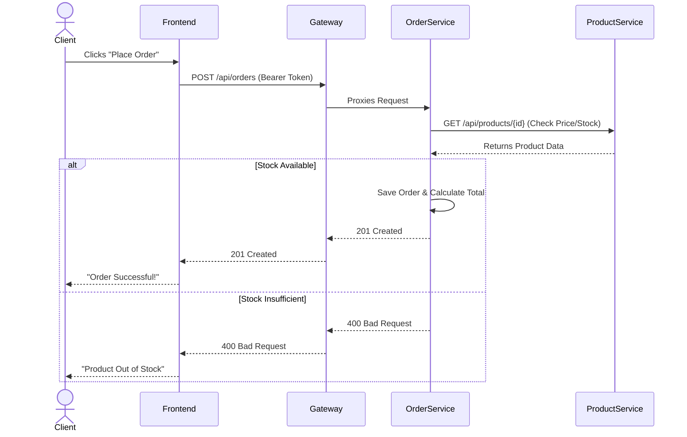

# Secure Micro-services Application

This project is a secure micro-services application for Product and Order management, built with Spring Boot, React, and Keycloak, and containerized using Docker.

## Architecture

- **Frontend**: React (Vite) + TailwindCSS
- **API Gateway**: Spring Cloud Gateway (Port 8888)
- **Product Service**: Spring Boot + Postgres (Port 8081)
- **Order Service**: Spring Boot + Postgres (Port 8082)
- **Security**: Keycloak (OAuth2 / OIDC)
- **Infrastructure**: Docker Compose (Keycloak, Postgres, SonarQube, Zipkin)

## Prerequisites

- Docker Desktop
- Java 17+ (for local dev)
- Node.js 18+ (for local dev)

## Setup & Running

1. **Start Infrastructure**:
   ```powershell
   docker-compose up -d
   ```

2. **Configure Keycloak**:
   - Access Keycloak at `http://localhost:8080` (admin/admin).
   - Import `realm-export.json` to create the `MicroServiceRealm` with pre-configured users and clients.
   - Users:
     - `admin` / `admin` (Role: ADMIN)
     - `client` / `client` (Role: CLIENT)

3. **Build & Run Services**:
   - You can run services locally via IDE or build Docker images.
   - **Local**:
     - Product Service: `cd product-service && ./mvnw spring-boot:run`
     - Order Service: `cd order-service && ./mvnw spring-boot:run`
     - Gateway: `cd gateway-service && ./mvnw spring-boot:run`
     - Frontend: `cd frontend && npm install && npm run dev`

4. **Access Application**:
   - Frontend: `http://localhost:3000`

## Security

- All API endpoints are secured via JWT.
- Frontend uses OIDC `Authorization Code Flow` with PKCE.
- Gateway validates tokens and relays them to micro-services.
- Role-based access control (RBAC):
  - **ADMIN**: Manage products.
  - **CLIENT**: Manage orders.

## DevSecOps

- **SonarQube**: Available at `http://localhost:9000`. Run `mvn sonar:sonar` to analyze.
- **OWASP Dependency Check**: Run `mvn dependency-check:check`.
- **Trivy Scan**: Run `.\trivy-scan.ps1`.

## Technologies

- Spring Boot 3.3.0
- Spring Cloud 2023.0.1
- React 18, Vite, TailwindCSS
- Keycloak 24+
- PostgreSQL
- Docker & Docker Compose

## Architecture Diagrams (Assignment Deliverables)

### 1. Global Architecture


### 2. Order Process Sequence

